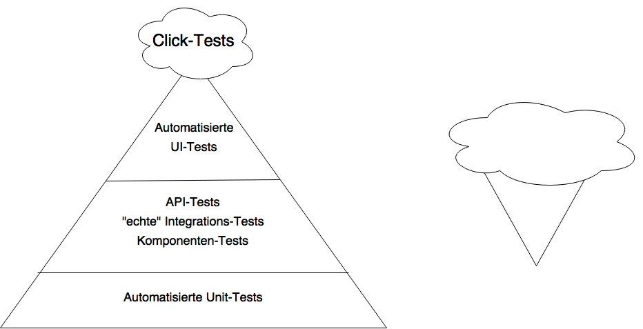

= Test-driven Development mit Spring Boot 2: Keine Ausreden gegen Integrationstest
Michael Simons <michael.simons@innoq.com>
:doctype: article
:source-highlighter: coderay
:icons: font
:sectlink: true,
:sectanchors: true,
:numbered: true

[abstract]
--
Am Anfang eines Projektes wird heutzutage in der Regel Wert auf Tests gelegt. Projekte werden sogar als Test-getrieben aufgesetzt (Test-driven-development, TDD). Schleicht sich Streß ein oder lässt die Begeisterung nach, kann es passieren, dass das Thema Tests, obwohl wichtig, vernachlässigt werden. Das gilt umso mehr, je schwieriger Komponenten eines Systems zu testen sind, unabhängig, ob sie einzeln oder integriert betrachtet werden.

Erfahren Sie in in diesem Artikel, wie Spring Boot 2 Ihnen dabei hilft, sehr einfach Integrationstests zu schreiben: Sei es als vollständiger Durchstich oder als Integrationstest auf einer technischen Ebene.
--

== Hehre Ziele

Tests und Dokumentation sind wichtige Aspekte einzelner Anwendungen und sicherlich der meisten Anwendungssysteme. Beide Themen sind gleichermaßen vielschichtig und finden auf unterschiedlichen Ebenen statt. Tests und Dokumentation finden unter anderem auf folgenden Ebenen statt:

* Methodenebene
* Klassenebene
* Modulebene
* Systemebene

Genauso unterschiedlich wie die Ebenen sind die Ziele. Tests werden oftmals genutzt, um die Korrektheit von Komponenten nachzuweisen. Das sind dann in der Regel Unittests. Der nächste Schritt ist sicherzustellen, dass Komponenten untereinander funktionieren. Es wird von Integrationstests gesprochen. Regressionstests können sowohl als Unit- als auch Integretionstest ausgeprägt sein. Regressionstests sollen Fehler nach Änderungen von Komponenten aufdecken, das heißt, dass Regresionstests wiederholbar sein müssen, um das Ergebnis eines alten mit dem Ergebnis eines neuen Testfalls vergleichen zu können.

Hinsichtlich Dokumentation ist das Feld ähnlich vielfältig. Es wird von Code-, API-, Architektur- und Anwenderdokumentation gesprochen. Zusammenfassend möchte ich behaupten, dass Dinge zum einen auf mikroarchitektonischer und makroarchitektonischer Ebene getestet und dokumentiert werden können.

Zu Beginn eines Projektes haben Tests und Dokumentation noch eine weitere Gemeinsamkeit: Es wird beides gemacht, manche Projekte werden sogar rein testgetrieben (Test-driven) aufgesetzt. Schleicht sich allerdings Streß ein, sei es durch zeitlichen Druck, unklare Anforderungen oder anderes mehr, werden gerne eines oder beide Themen vernachlässigt. Hinterher Tests zu schreiben bringt oftmals keinen direkten Mehrwert mehr und eine Nachdokumentation macht selten Spaß.

Der im folgenden vorgestellte Stack soll dabei helfen, von Anfang an testgetrieben zu Entwickeln und diese Ziele nicht aus dem Auge zu verlieren.

== Die Testpyramide

Der Autor https://watirmelon.wordpress.com/about/[Alister Scott] stellte 2012 den Begriff der https://watirmelon.blog/2012/01/31/introducing-the-software-testing-ice-cream-cone/[Testpyramide] und das dazugehörige Antipattern, das Testing-Eishörnchen vor.

Unit-Tests sind -- die richtige Herangehensweise vorausgesetzt -- einfach zu erstellen und sollten zahlreich vorhanden sein. Integrationstest in vielfältigen Ausprägungen (im Bild als API Tests, "echte" Integrationstests zwischen Systemen oder als Tests zwischen Komponenten), sind in der Regel aufwendiger und eine der Königsdisziplinen sind automatisierte UI-Tests, darüber hinaus sind nur noch Click-Tests durch echte Benutzer angesiedelt. Die sind in der Regel einfach durchzuführen, dadurch nicht weniger teuer. Leider sieht es in der Realität oftmals eher so aus, dass die "Wolke" an der Spitze übermässig groß ist und die Pyramide umgekehrt wird: Ein teures Eishörnchen.

.Das Beispiel
****
Gestestet werden soll ein Service, der Events und dazugehörige Registrierungen verwaltet. Ein einem Tag findet nur ein Event statt, Events haben eine begrenzte Teilnehmeranzahl. Interesierte Besucher melden sich mit Namen und einer E-Mail-Adresse an und sollen sich nicht mehrfach anmelden können. Von einem Event soll zum vorherigen und nächstem Event navigiert werden können. Der Dienst stellt dazu eine einfache Oberfläche zur Verfügung.
****

== Test-Werkzeuge

2017 erschien mit JUnit 5 eine komplett neue Version des bekannten Test-Frameworks http://junit.org/[JUnit]. JUnit 5 ist modular aufgebaut und besteht aus

* der JUnit Plattform
* JUnit Jupiter
* JUnit Vintage

Die Plattform stellt dabei die API der Test-Engine und eine Ablaufumgebung für Tests jeglicher Art auf der JVM bereit. Die Plattform beihaltet auch die Plugins für die Build-Management-Werkzeuge Gradle und Maven. JUnit Jupiter ist eine Implementierung der Test-Engine. JUnit Vintage wird nur benötigt, um JUnit-4-Tests auf der aktuellen JUNit-5-Plattform ablaufen zu lassen.

JUnit 5 wurde als JUnit-Lambda begonnen. Es überrascht wenig, dass neue Assertions fast alle Java-8-Lambdas unterstützen. Aber nicht nur die konsequente Unterstützung von Lambdas, Java-8-Supplier für Tests, sondern auch verschachtelte Tests, Gruppierungen von Assertions, Displaynamen für Tests und Kategoriersierung von Tests mit Hilfe von Tags sind gute Gründe dafür, dass Sie einen Blick auf JUnit 5 werfen.

Das Beispielprojekt wird mit http://junit.org/junit5/[Gradle] gebaut und die Plattform muss entsprechend in der Datei `build.gradle` konfiguriert werden:

[source,groovy]
.build-gradle
----
include::../../build.gradle[tags=junit5config]
----
<1> Versionen werden in diesem Projekt über globale Propertys verwaltet
<2> Gradle benötigt die Abhängigkeit zur JUnit-Plattform während des Build-Prozess…
<3> …um das entsprechende Plugin konfigurieren zu können
<4> Die eigentlichen Abhängigkeiten zu _Jupiter_ werden während des Kompilierens der Tests…
<5> und zur Laufzeit derselben benötigt

JUnit 5 lässt sich vollständig aus Gradle heraus konfigurieren, bitte schlagen Sie in der http://junit.org/junit5/docs/current/user-guide/#running-tests-build-gradle[Dokumentation] nach.

== Unit-Tests der Domain

=== Das Root-Aggregat

Die Entwicklung beginnt mit der Domain und Unit-Tests. Ich verwende in diesem Projekt JPA, um Events in einer relationalen Datenbank zu speichern; es müssen also einige Java-Annotationen verwendet werden. Diese verhindern allerdings die Testbarkeit der Domain-Klasse `Event` nicht. Die Klasse Event wird strikt von der vorgegeben Fachlichkeit getrieben, die JPA-Annotationen wurden im Source-Code ausgeblendet, sie sind für das Beispiel irrelevant.

[source,java]
.Event.java
----
include::../main/java/ac/simons/tdd/domain/Event.java[tags=eventStructure]
----
<1> Ein Event muss verschiedene Zeitpunkte verarbeiten, eine Registrierung ist abhängig davon, ob das Event schon stattfand oder nicht. Naiv auf `LocalDate.now()` zu Vergleichen, macht die Klasse schwerer testbar, da `now()` keine Seiteneffektfreie Funktion ist. Offensichtlich wird je nach Zeitpunkt ein anderer Wert zurückgegeben. Über die Java-8-Klasse `Clock` kann für Testfälle ein fester Wert genutzt werden.

Die Klasse `Event` macht deutlich, dass es keiner Vielzahl Schichten und Services bedarf, um domainorientiert zu arbeiten. Sie können die fachlichen Anforderungen einfach ablesen und genauso einfach testen. Beispielhaft erfahren Sie im Folgenden, wie die Vor- und Nachbedingungen (Pre- und Postconditions) des Konstruktors und die eigentliche Logik des Registrierens mit aktuellen JUnit-5-Methoden getestet werden:

[source,java]
.EventTest.java
----
include::../test/java/ac/simons/tdd/domain/EventTest.java[tags=eventStructureTest]
----
<1> Tests sollen in Isolation ablaufen. Das Ergebnis eines Tests darf andere nicht ändern. Ältere Versionen von JUnit haben per Default die Testklasse für jeden Test neu erzeugt. Methoden, die vor jedem Test ablaufen, mussten daher statisch sein. JUnit 5 hat einen neuen Lebenszyklus `PER_CLASS`, der hier angewandt wird.
<2> Wird vor jedem Test -- auch den Tests in verschachtelten Klassen -- aufgerufen, wenn der Lebenszyklus `PER_CLASS` genutzt wird. Die Methode muss nicht statisch sein. Hier wird sichergestellt, dass sich der Test der Event-Klasse immer auf ein bestimmtes Datum bezieht.
<3> Verschachtelte Tests erlauben es Ihnen, Themen gezielt zu adressieren
<4> Die JUnit 5 TestFactory ist eine Form von parametrisierten Tests. Sie gibt eine Liste, ein Iterable oder wie im Beispiel einen Stream von dynamischen Tests zurück. Alle Einträge werden erst bei Bedarf instanziiert. Möglichen machen es die Test-Supplier (im Beispiel natürlich als Lambda implementiert).
<5> Die TestFactory testet hier sowohl ein Datum in der Vergangenheit als auch ein ungültiges Datum. Pro Eintrag im Stream wird ein dynamischer Test erzeugt, der sowohl die Art der ausgelösten Exception als auch ihre Nachricht überprüft
<6> Natürlich sollten Sie nicht nur die Pre Conditions, sondern auch die Post Conditions überprüfen, sprich bei gültiger Eingabe ist ein gültiges Ergebnis zu erwarten. Dieser Test hier ist auf klassische Art als `@Test` annotiert und beinhaltet nur einen Testfall.
<7> `assertAll` überprüft alle verschachtelte Assertion. Ich würde `assertAll` immer dann nutzen, um eine Menge von Behauptung nach der Benutzung einer defininierten Menge von Parametern zu überprüfen, nicht um verschiedene Parameter zu testen.
<8> Der Test der Registrierungslogik basiert dann wieder auf `@TestFactory`, um kompakt alle Testfälle abdecken zu können. Ich arbeite an dieser Stelle mit Template-Methoden, die mir das zu testende Objekt im passenden Zustand erzeugen. Wenn Sie genau hinschauen bemerken Sie, dass ich auch nicht davor zurückscheue, mir einen Testkandidat mit Hilfe von Reflection im passenden Zustand zu erzeugen, ich betrachte diesen Unittest explizit als White-Box Test.

=== Der Event-Service

Nachdem wir sichergestellt haben, dass die Klasse `Event`, das Root-Aggregate dieser Domain, für sich alleine funktioniert, wenden wir uns komplexeren Dingen zu. Das Event kann für sich alleine beim Anlegen nicht feststellen, ob es schon ein Event am selben Tag gibt. Wir könnten jetzt auf die Idee kommen, diese Überprüfung an die Möglichkeiten der Datenbank zu deligieren, konsequent Unique-Keys zu nutzen und Fehlermeldungen abzufangen. Dieses Vorgehen nimmt uns nicht nur jede Menge Kontrolle aus der Hand, sondern verteilt unserere fachliche Logik auf zu viele Ebenen. Statt dessen führen wir ein Repository ein, dass die Menge aller Events in einer Art Kollektion kapselt (siehe https://de.wikipedia.org/wiki/Repository_(Entwurfsmuster)[Repository]) und einen Service, der dieses Repository nutzt, um einzelne Events zu selektieren.

[source,java]
.EventTest.java
----
include::../main/java/ac/simons/tdd/domain/EventRepository.java[tags=eventRepositoryStructure]
----

Das Repository bleibt angenehm frei von Annotationen. Spring-Data-Repositorys werden überlicherweise nur als Interfaces deklariert. Spring Boot konfiguriert Spring Data automatisch und Spring Data sorgt dafür, dass zur Laufzeit eine Implementierung dieses Interface zur Verfügung steht, das die deklarierten Methoden bereitstellt. Üblicherweise teste ich diese Methoden nicht mehr, es sei denn, sie basieren auf SQL-Abfragen. Das ist dann allerdings ein Fall für einen Integrationstest.

== Weitere Herausforderungen

* Continous delivery, schnelle tests
* unabhängiges testen von services
* pro weniger tests

== Über den Autor

{author} arbeit als Senior Consultant bei https://www.innoq.com/de/[innoQ Deutschland]. Er ist Mitglied des NetBeans Dream Team und Gründer der Euregio JUG. Michael schreibt in seinem http://info.michael-simons.eu[Blog] über Java, Spring und Softwarearchitektur. {firstname} ist Autor des im Januar 2018 erscheinenden Spring Boot Buches.

Auf Twitter unterwegs als @rotnroll666, unter anderem mit Java, Music und den kleineren und größeren Problemen als Ehemann und Vater von 2 Kindern.